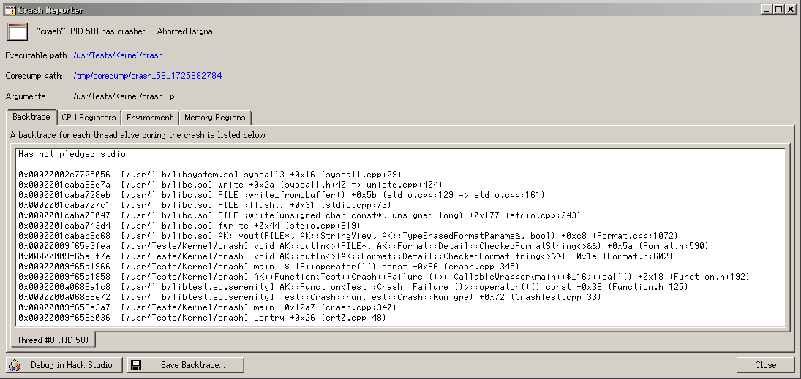

## Name

 CrashReporter - information about crashed programs

[Open](file:///bin/CrashReporter)

## Synopsis

```sh
$ CrashReporter [--unlink] <coredump-path>
```

## Description

CrashReporter informs about crashed programs by providing a GUI to examine the crashed program's last state.



The four main tabs display the call stack (or backtrace) when the program crashed, the CPU registers just before crashing, the environment variables and the mapped memory regions. For registers and backtrace, there is one tab per thread.

The buttons allow to open the relevant files in HackStudio, or to save the text of the backtrace to a file.

If CrashDaemon is running, CrashReporter is automatically opened when a program crashes.

## Options

-   `--help`: Display help message and exit
-   `--version`: Print version
-   `--unlink`: Delete the coredump after it's parsed

## Arguments

-   `coredump-path`: Path to the core dump file to display

## See Also

-   [`dump_backtrace`(2)](help://man/2/dump_backtrace)
