## Name

 FontEditor - Serenity font editor

[Open](file:///bin/FontEditor)

## Synopsis

```**sh
$ FontEditor [file]
```

## Description

FontEditor is the font editing application for creating and editing bitmap font files in SerenityOS.

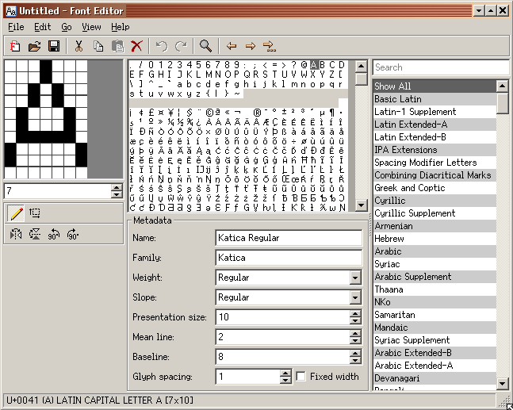

### Basic Parts

FontEditor has the following basic parts:

1. The menu bar at the top
2. The toolbar
3. The main workspace
4. The status bar at the bottom

Presently, you can resize the entire FontEditor form to your liking. You can turn the visibility of Font Metadata and Unicode Blocks on or off. You can change the glyph editor window zoom factor. All of these things are currently available in FontEditor automatically.

### The Toolbar

The Toolbar contains the same functional entries as that of the Menubar and is represented as clickable icons. Hovering on each icon will display additional information listed in the status bar which further states what each icon does.

### The Main Workspace

The main workspace has three partitions:

-   The **_left section_** contains the glyph editor window. This window has three different zoom factors for ease of use and for your viewing comfort. They are 500%, 1000% and 1500%. You can freely switch to any zoom level at anytime while creating your font. Don't let the size of the glyph editor window fool you. This is where you will spend about 95% of the time. And the task is that of shaping each glyph by left-clicking on the mouse. You can form a dot, a line, or a complete glyph just by connecting the dots. If you need to undo a certain location with a black dot, you can right-click on top of the target area and it will revert back to empty. Each grid area can hold any of the three states: 1) on or black 2) off or white 3) empty or gray. On state is displayed as black by default. Off state is displayed as white by default. Empty state is displayed as gray by default. Off state or white is relevant most specially if the font is fixed-width as it dictates the distance a glyph will have from left, center or right. Empty state or gray is important for variable-width font as it affects the overall width of the glyph. For variable width fonts, you move the glyph flushed left on the glyph editor window and remove any extra empty grids by decrementing the present column counter located right under the glyph editor window and thereby leaving only the entire glyph all by itself. Below the glyph editor is the glyph tool which contains the following: the pen icon for creating the glyph itself, the move icon to enable the entire glyph move to top, down, left or right from within the glyph editor window. Below the glyph tool are the transform icons which are flip horizontal, flip vertical, rotate counter-clockwise 90°and rotate clockwise 90°. Transform tools are most helpful when copying over existing glyphs and transforming them to form a new glyph. A becomes V, M becomes W, c becomes e, n becomes u, etc.

-   The **_middle section_** contains two parts: the upper part which holds the entire glyph content of the font, or lack thereof if you are making a new one. And the lower part which contains **_Metadata_** information such as name, family, weight, slope, presentation size, mean line, baseline, glyph spacing and if the font is either fixed-width or variable-width. You can still further tweak your font parameters via the Metadata section. The `Fixed width` toggle located at the right side next to Glyph spacing is of special note. It applies to the entire font file. It does not only apply to a single glyph or group of glyphs. It is the differentiating factor that informs the system if the font is or is not fixed-width. Fixed-width fonts are mostly used for Terminals and for displaying source code.

-   The **_right section_** displays a searchable list of Unicode Blocks.
    Metadata and Unicode Blocks can be turned on or off in `Menu → View`. Selecting a Unicode Block will show only the glyphs contained within the range of that block. Basic Latin covers 000-007F, Latin-1 Supplement covers 0080-00FF, Latin Extended-A covers 0100-017F and so on and so forth. Global search for a glyph is affected when a certain block is currently selected. Only by selecting `Show All` will the global glyph search work as expected. So make it a habit of confirming that Show All is active before searching for a glyph.

### The status bar

The status bar displays additional information describing what each menu entry and toolbar icon does. It identifies the unicode value of the glyph currently under the cursor. It shows the glyph's visual representation (if available), description and dimensions. The right-most segment displays the code point range of the currently selected Unicode Block. Clicking this segment will toggle the display of the Unicode Block list. Second only to the glyph editor window, the status bar is your next best friend on your path to becoming a font master.

## Tutorial: Create a new font

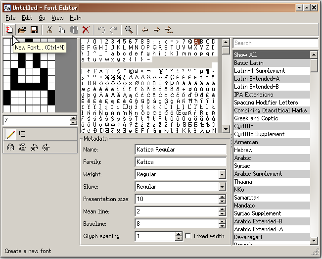

To create a new font, you can either click on New Font icon on the Toolbar or go to `File → New Font` in the Menubar.
A wizard will walk you through setting the needed parameters for your new font.

### Typeface Properties

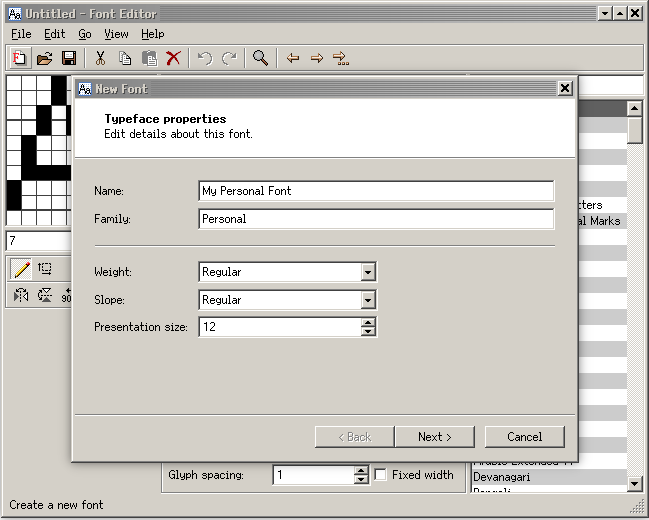

You can try out the default values just to get the feel of the program.

### Glyph Properties

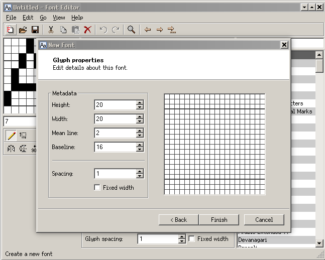

Just click **Finish** when you are so inclined.

### Edit Glyph Properties

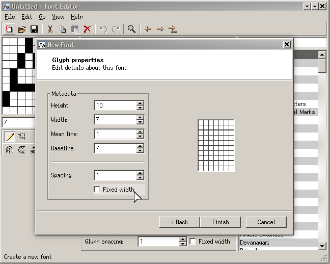

Adjust the values to suit your needs. The higher the value, the larger the font size.

### Untitled font

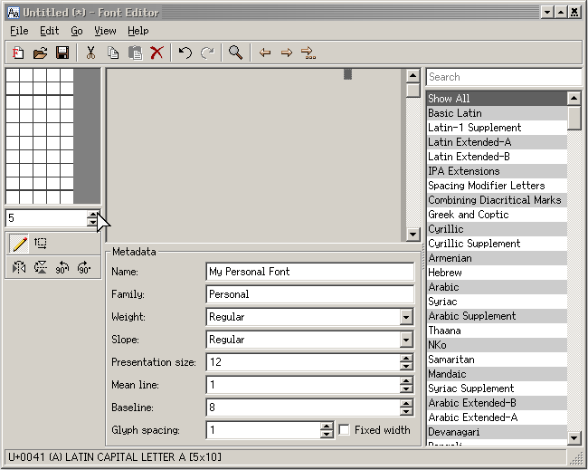

Congratulations on your successful initial font setup. Now you are ready to begin. And begin you shall. There is more to font creation than simply scribbling away. You need to always remind yourself this question: "Where is the fun in that?". Start with what you need to do while striving to achieve fun in the process. Let's be honest, font creation is one of the many thankless jobs, unless and until there is fun in it, why bother?

### Launch another instance

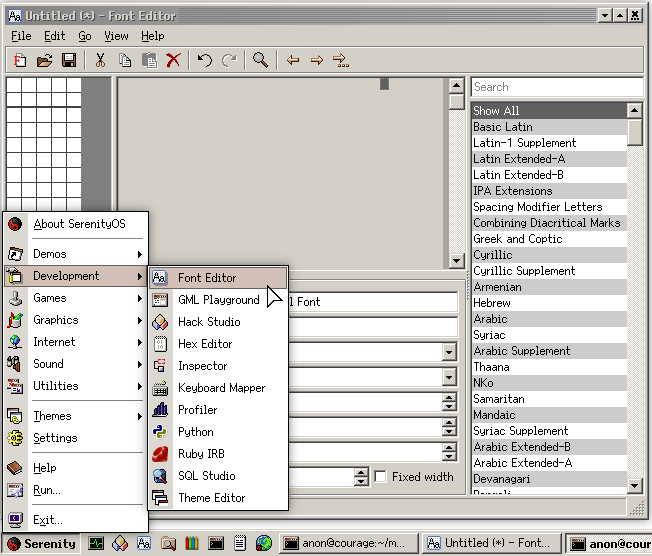

The figure above shows where you can find FontEditor from inside the SerenityOS desktop.

### Side by side

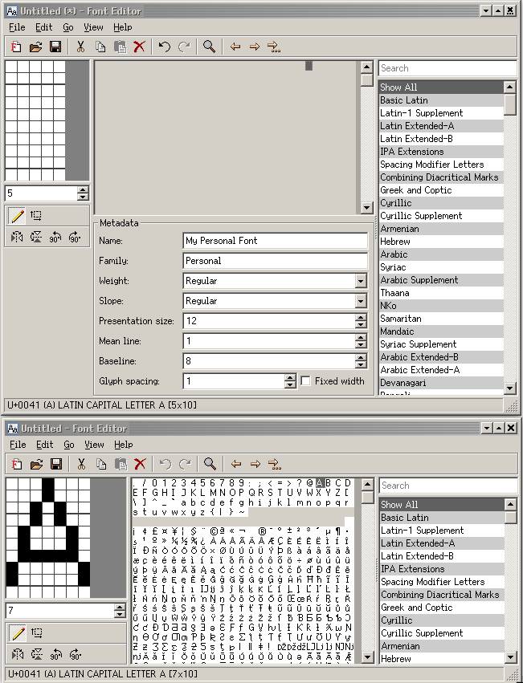

Having another instance of FontEditor can help boost productivity. This is most noticeable when one is just starting out in using FontEditor and trying out how to best make use of the application. Don't be afraid to experiment, let your inner font master slowly shine through. It is best to maintain the feeling of having fun while silently grinning from ear to ear as you steadily create form and personality in your font. Don't be afraid to start again, if you must. As with the entire workflow, being aware when to start, when to stop and when to reset is crucial. With FontEditor to assist you, starting from scratch is no longer an arduous process.

### Save font

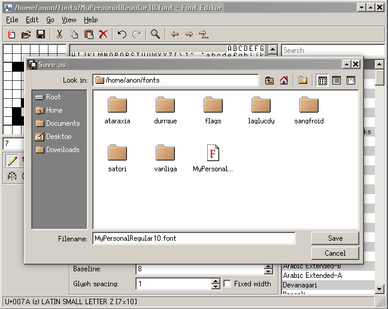

Save your font by following the recommended `FontName + FontStyle + FontPresentationSize + .font` naming convention.

### Continue Editing

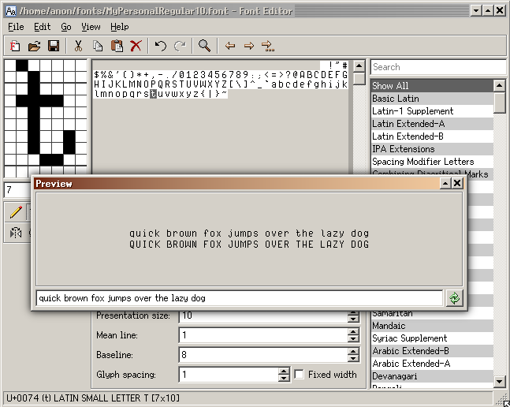

The figure above shows some previously made glyphs. Those with sharp eyes can immediately see that the glyphs for M and W, O and Q came from the same base. W was copied over from M and was flipped horizontally. Q was copied over from O and a descender was added to achieve the final glyph. Continue editing your font by adding more glyphs into it. Take your time in creating the font, only you know the reason why the glyph is formed the way it is. You know why the height and the width is so, why the curvature is just so. Aside from achieving balance, maintain the spirit of fun in making your font. The more glyphs are added, the easier it is to get the general feel and character of the font. Remember to always save and to save often.

### fonts.serenityos.net

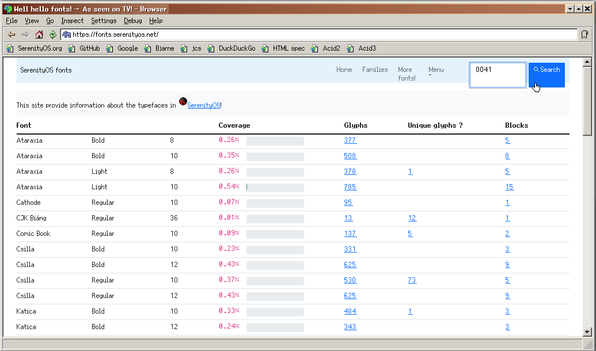

It is highly recommended to use our own [fonts portal](https://fonts.serenityos.net) as one of your primary resource for glyph and font information. The others are [Unicode charts [unicode.org]](https://www.unicode.org/charts/) and our [wiki](https://wiki.serenityos.net).

### Search glyph

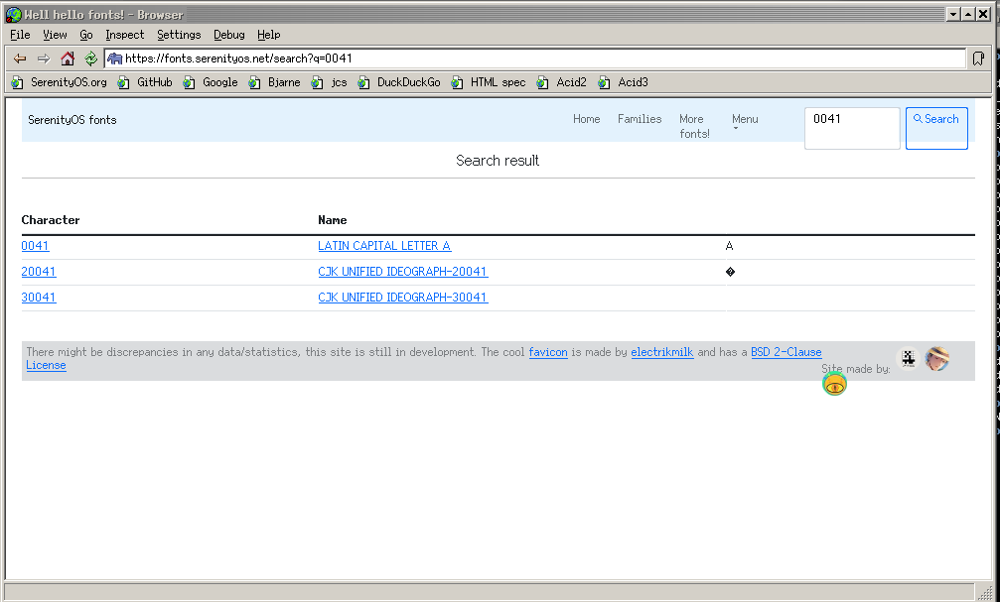

Figure above depicts a search session on the [fonts.serenityos.net](https://fonts.serenityos.net) portal.

### Search detail

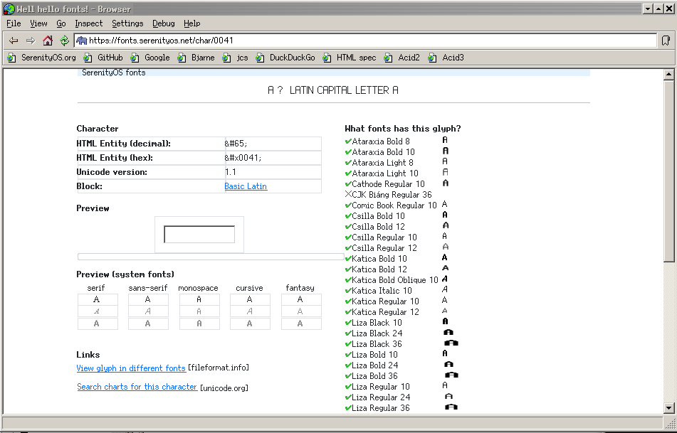

The same search session displaying result of the previous query.

So there you have it, by now you have at least an idea of how to make **_SerenityOS_** fonts using **FontEditor**. For any font-related questions or inquiries, just drop by the official [SerenityOS Discord #fonts](https://discord.com/channels/830522505605283862/927893781968191508).
