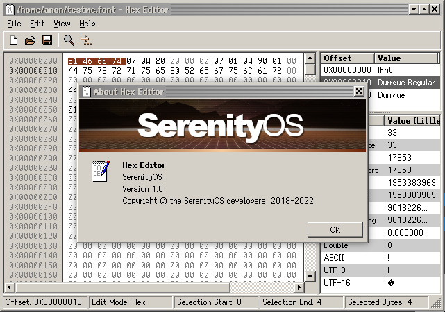
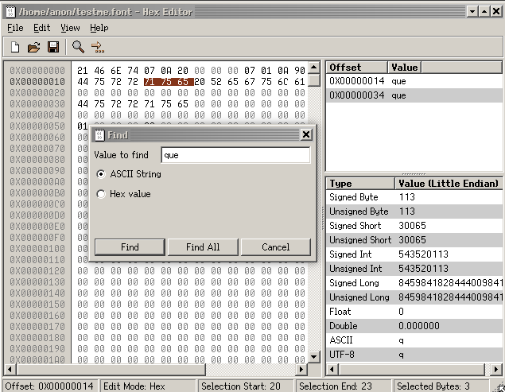
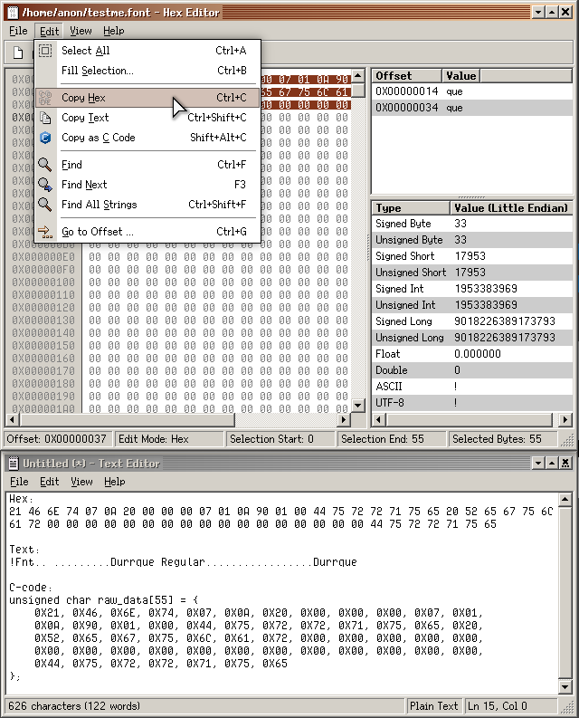

## Name

 Hex Editor - Binary file editor

[Open](file:///bin/HexEditor)

## Synopsis

```**sh
$ HexEditor [--annotations <path>] [file]
```

## Description

`Hex Editor` is an application that displays and edits raw and exact file contents.

Hex Editor abstracts data access into documents, one for memory based streaming (unsaved new files), and another for file based streaming. Hex Editor does not store the entire file in memory, thereby improving load times and efficiently maximizing memory usage.



### Value Inspector

The core feature of Hex Editor is value inspector functionality. The inspector operates on current cursor position (or selection start range if one is selected) and interprets bytes moving forward as various data types. The inspector can toggle between big and little endian modes. A value selected in the inspector has its associated bytes that makes up that value gets highlighted in the editor.

### Find value

One can search using ASCII string or Hex value, the result will be displayed on the right side with corresponding ValueInspector information.



### Copy value

An option to copy as hex value, as text, or as C-code is available and can extract the file in parts or as a whole. The figure below shows all three output formats transferred into Text Editor.



Hex Editor's simple and straight-forward interface offers search, export, byte pattern insertions and statistics.

## Options

-   `-a`, `--annotations`: Path to an annotations file to load on startup

## Arguments

-   `file`: File to open on startup
