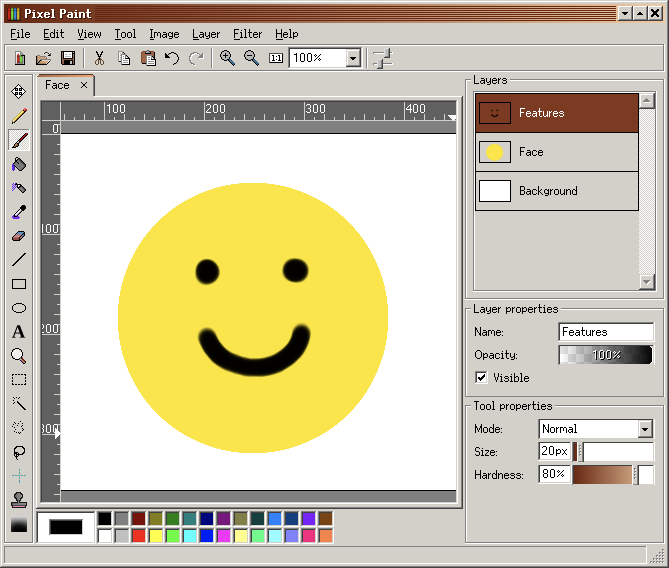
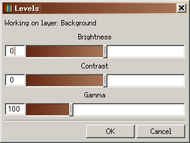
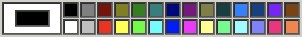
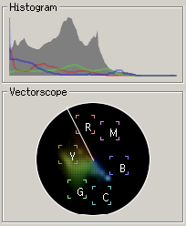
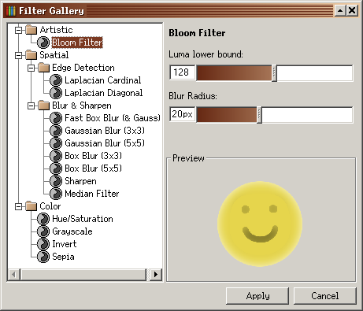

## Name

 Pixel Paint - Image Editor

[Open](file:///bin/PixelPaint)

## Synopsis

```sh
$ PixelPaint [file]
$ pp
```

## Description

`Pixel Paint` is a feature-rich image editing application inspired by the likes of classic [Microsoft Paint](https://en.wikipedia.org/wiki/Microsoft_Paint#Windows_9x), though includes many more advanced features such as tabs, layers and filters.

Documents can be saved as Pixel Paint Files (`.pp`), preserving layers and images.

The supported export formats are BMP, PNG and QOI ([Quite Okay Image Format](https://qoiformat.org)).

## User Interface



The interface follows familiar conventions, making it easy for users experienced with other image editors to pick up. Most options are accessible through the Menu bar and are searchable with `Ctrl+Shift+A`.

### Toolbar

The toolbar contains common actions such as creating, opening and saving a file. It also provides quick access to useful zoom levels (_Fit to width_, _Fit to height_ and _Fit entire image_).

#### Levels



The last icon on the toolbar opens the levels adjustment window. Levels control the exposure (light) in an image.

-   **Brightness** - Lighten or darken all colors.
-   **Contrast** - Increase or decrease the difference between light and dark areas.
-   **Gamma** - Redistribute light intensities, allowing adjustments that can bring a digital image closer to the way human eyes perceive details, particularly in darker areas.

### Main Workspace

-   The tab bar above the canvas allows multiple documents to be open simultaneously.
-   Surrounding the canvas is a vertical and horizontal ruler. When the Guide Tool is active, dragging from these rulers creates a line guide.
-   In the center is the Canvas in which you can paint, create shapes, write text and manipulate images. Use the left mouse-button to paint with the primary color and the right mouse-button to paint with the secondary color. Zoom in/out with `Ctrl +` / `Ctrl -` or use the mouse wheel. Pan with the middle-mouse button. Zooming-in far enough reveals a pixel grid which is useful for precise work, such as making pixel art.

### Color Panel



Below the canvas is the Color Panel. On the left is the Color Picker, showing the currently selected colors. The inner color is the primary color, the outer color is the secondary color. Click on either to change its color.
To the right of the Color Picker is a palette of default colors. Left-click on one to set it as the primary color and right-click to set as the secondary color. Switch primary and secondary colors by pressing `X`. Reset to default colors (black and white) by pressing `D`.
In the _Edit_ menu, palettes can be saved and loaded as `.palette` files. These are text files containing [Hex Color Codes](https://en.wikipedia.org/wiki/Web_colors#Hex_triplet), arranged by line from the top-left color going across.

### Status Bar

Below the Color Panel is the Status Bar. It displays the pixel coordinates of the cursor when it hovers over the Canvas. When the cursor hovers over the program's interface it describes what a button does.

### Tool Panel

To the left of the main workspace is the Tool Panel which showcases tools available for interacting with the canvas. When a tool is selected, using `[` / `]` adjusts the primary option in the Tool properties panel, e.g. _Size_ for the Brush Tool. Adding `Shift` will adjust the secondary option, e.g. _Hardness_ for the Brush Tool.
_Hardness_ refers to how sharp or abrupt the transition is between painted elements and the background, affecting edge clarity. _Feathered edges_ have a softer transition with a gradual decrease in intensity, creating a smooth and blended appearance contrasting with the sharpness of higher hardness.

#### Move Tool (`M`)

Moves layers. Select layers either in the Layers Panel or on the canvas. Layers below the top layer can be selected on the canvas if the top layer doesn't fill the entire canvas.

#### Pen Tool (`N`)

Paints with a square brush, by default 1px with 100% hardness. Increasing the thickness results in a larger square with 100% hardness. Useful for making pixel art. To draw a straight line, make a mark, hold `Shift` and click elsewhere.

#### Brush Tool (`P`)

Paints with a round brush, by default 20px with feathered edges. Size and Hardness can be adjusted. Useful for a more natural appearance. To draw a straight line, make a mark, hold `Shift` and click elsewhere.

#### Bucket Tool (`Shift+B`)

Will fill a closed shape, otherwise it will fill the whole layer.

#### Spray Tool (`Shift+S`)

Creates a textured effect by scattering pixels randomly within the round brush. The size of and density (how closely packed the pixels are painted) of the spray can be adjusted. Useful for creating fading effects.

#### Pick Tool (`O`)

Will make any selected color the primary color. By default, it samples only the active layer unless the option _Sample all layers_ is selected. Quickly use at any time by holding `Alt`.

#### Erase Tool (`Shift+E`)

Erases pixels from the current layer. Has two modes: Pencil (square brush with 100% hardness) and Brush (circular with adjustable hardness). Enabling _Use secondary color_ will apply the secondary color instead of making that part of the layer transparent.

#### Line Tool (`Ctrl+Shift+L`)

Creates a vector line that is rasterized (converted into a pixel equivalent) upon releasing the mouse. To constrain the angle to 22.5° increments hold `Shift` whilst drawing the line.

#### Rectangle Tool (`Ctrl+Shift+R`)

Draws a vector rectangle that is rasterized upon releasing the mouse. To draw a square hold `Shift` whilst drawing the shape.

Options:

-   **Outline** - Rectangle with no fill. The line thickness can be adjusted.
-   **Fill** - Filled with the primary color.
-   **Gradient** - Filled with a gradient between the primary and secondary colors, from left-to-right.
-   **Rounded** - Draws a vector square with rounded corners that is rasterized upon releasing the mouse. Adjust the corner radius before drawing, as it cannot be changed afterward.
-   **Anti-alias** - Smoothens jagged edges for a more polished appearance.
-   **Aspect ratio** - Sets the ratio of width and height (e.g. `1` x `1` for a square).

#### Ellipse Tool (`Ctrl+Shift+E`)

Draws a vector ellipse that is rasterized upon releasing the mouse. To draw a circle hold `Shift` whilst drawing the shape. Has many of the same options as the Rectangle Tool.

#### Text Tool (`Ctrl+Shift+T`)

Click to place the text and start typing. Use `Shift+Enter` to create a new line. Press `Esc` to cancel. The text will use the primary color. Choosing a different color will change the color of the text. Modify the font and font size in the Tool properties. Adjust the text's position while editing. Once you press `Enter` or click away from the text, it will be rasterized and become non-editable.

#### Zoom Tool (`Z`)

Left-click to zoom-in, right-click to zoom-out. Adjust the increment size in the Tool properties.

#### Selection Tools

Select All with `Ctrl+A`. Press `Esc` to clear a selection. Invert a selection in the _Edit_ menu.

Modes:

-   **Set** - Making an initial selection.
-   **Add** - Expands the selection area with each new selection, including merging areas.
-   **Subtract** - Removes areas from selection.
-   **Intersect** - Keeps the overlap with other selections.

##### Rectangle Select Tool (`R`)

Selects a rectangular-shaped area. Holding `Ctrl` will expand the selection equally on all sides.

##### Wand Select Tool (`W`)

Selects an area based on its color. Adjust the threshold for a more or less precise selection.

##### Polygonal Select Tool (`Shift+P`)

Click to draw the vertices of a polygon. Hold `Shift` to constrain to 22.5° increments. It will become a selected area once a whole shape. Quickly close a shape by double-clicking. _Feathering_ can be adjusted, which in this context will give rounded corners.

##### Lasso Select Tool (`L`)

Freehand draw a shape, which will become a selected area once whole. Letting go of the mouse will automatically close the shape.

#### Guide Tool (`G`)

Create a guide line by dragging from either of the rulers surrounding the Canvas. Hold `Shift` whilst dragging to do this in 10px increments (adjustable in the Tool properties). Existing guides can be moved. Right-click on a guide to delete it or open the _Set Offset_ menu to modify its orientation and offset (the distance in pixels from the top or left-hand ruler). Useful for maintaining alignment when editing. Guide lines are not visible on export.

#### Clone Tool (`C`)

Hold the `Alt` key and click to specify the area to clone (indicated by a green circle). Then paint the clone. Currently it can only clone from the same layer. Size and Hardness of the brush can be adjusted.

#### Gradient Tool (`Ctrl+G`)

Click and drag to create a gradient, transitioning from the primary color to transparent by default. Change it to go from the primary to the secondary color in the Tool properties. Adjust the colors in the Color Panel. Move the gradient by grabbing the middle handle and change the size and orientation with the outer handles. Hold `Shift` to constrain to a horizontal or vertical orientation. Press `Enter` to rasterize or `Esc` to cancel.

### Editor Panels

To the right of the main workspace, editor panels facilitate layer configuration, tool adjustments and provide information about the colors in an image. Minimize a panel by double-clicking its name label or using the toggle. Rearrange panels by dragging the name label. Turn them into resizable windows by dragging them out or pressing the detach icon. Turn all of them into a separate window by dragging the _Editor Panels_ label out or pressing its detach icon. Turn a detached window back into a panel by closing the window.

The default panels are:

-   **Layers** - Add, remove, reorder or manipulate layers. Adjust layers by right-clicking or in the _Layers_ menu.
    -   **Masks** - An overlay that controls a layer's visibility: black hides, white shows and shades of gray provide varying levels of transparency. Masks are non-destructive, allowing reversible edits without permanently altering the original image. Return to the mask menu to delete (completely remove a mask), apply (merge the mask and the underlying layer), invert (reverse the black and white contents) and clear (retain an empty mask layer).
-   **Layer properties** - Rename, show/hide or adjust the opacity of a layer.
-   **Tool properties** - Configure the settings for the currently selected tool.

#### Color Visualizations



Two additional editor panels that visualize color can be enabled in _View → Scopes_:

-   **Histogram** - A graph showing the range of color tones in an image, from the darkest on the left to the lightest on the right. As the cursor hovers over the canvas, a yellow line indicates where the pixels under the cursor are represented on the graph.
-   **Vectorscope** - Corresponding to the [color wheel](https://en.wikipedia.org/wiki/Color_wheel), the markings indicate the degree of Hue and Saturation in an image. The further the marking from the center, the greater the Saturation. The line going up between red and yellow is the Skin Tone Line indicating the optimal location for all skin tones. As the cursor hovers over the canvas, a circle highlights where the colors are represented on the Vectorscope.

### Filters



In the _Filter_ menu is the Filter Gallery which enables adjustment of the whole image (by default), or a selection, by tweaking colors or applying effects.

#### Artistic

-   **Bloom** - Adds a glow around bright areas. Adjust the glow area brightness threshold and the radius of the glow.

#### Edge Detection

Edge detection highlights transitions between visual elements, emphasizing object boundaries. There are two different methods of achieving this:

-   **Laplacian Cardinal** - Emphasizes horizontal and vertical edges, accentuating areas with significant intensity changes along these cardinal directions.
-   **Laplacian Diagonal** - Emphasizes and highlights diagonal edges in an image, focusing on areas with pronounced intensity changes along diagonal directions.

#### Blur & Sharpen

Various methods exist for producing a blur, leading to varied results. They differ in how they allocate weight, which represents the value assigned to pixels determining their greater or lesser impact on the final image. The Gaussian and Box Blurs offer two choices: `3x3` and `5x5`, indicating the grid size for blur calculation. In simple terms, a larger grid results in a smoother blur.

-   **Fast Box Blur** - Quickly blurs an image by averaging the colors of pixels within a defined square area, resulting in a smoother appearance. The blur's radius can be adjusted. Enable _Asymmetric Radii_ to adjust the blur along the horizontal, vertical or both axes. Enable _Use Direction and Magnitude_ to adjust the blur angle and intensity. The _Approximate Gaussian Blur_ option achieves a smoother blur by applying the box blur multiple times with different weights.
-   **Gaussian Blur** - Smoothens an image by gradually blending pixel colors based on a bell-shaped distribution, resulting in a softened appearance.
-   **Box Blur** - Takes more time than a Fast Box Blur by considering a broader range of neighboring pixels, resulting in a more thorough and refined smoothing.
-   **Sharpen** - Enhances the clarity and detail of an image by increasing the contrast at edges, making them more distinct.
-   **Median Filter** - Replaces each pixel's value with the median value of its neighboring pixels, providing effective noise reduction while preserving edges and details. Useful for removing dust or defective pixels from an image.

#### Color

-   **Hue/Saturation** - Precisely adjust the colors in an image by modifying the type of color, its intensity and the amount of black/white mixed in with it.
    -   **Hue** - The type of color, based on degrees of the color wheel starting from 0% (red).
    -   **Saturation** - The purity of the color, from 0% (black) to 100% (pure color).
    -   **Lightness** - The amount of black/white mixed in with the color, from 0% (black) to 100% (white).
-   **Grayscale** - Converts an image to black and white by removing the color information, resulting in shades of gray based on the original colors' intensity.
-   **Invert** - Transforms an image by reversing the colors, turning dark areas light and vice versa.
-   **Sepia** - Makes an image black and white while adding warm, brownish tones, creating a nostalgic or aged appearance reminiscent of old photographs. The intensity can be adjusted.

#### Generic 5x5 Convolution

The last option in the _Filter_ menu, a Generic 5x5 Convolution filter alters an image by using a 5x5 grid of numbers to recalculate each pixel's appearance based on its nearby pixels. The _Normalize_ option keeps the brightness consistent, maintaining a balanced and normalized appearance. The _Wrap_ options makes sure calculations consider pixels on the other side, especially at the image edges, for a smoother effect. Without wrapping, the convolution might produce artifacts or irregularities at the image borders.

## Arguments

-   `file`: The image file to be edited

## Example

```sh
$ PixelPaint /home/anon/Documents/cat.jpg
```
