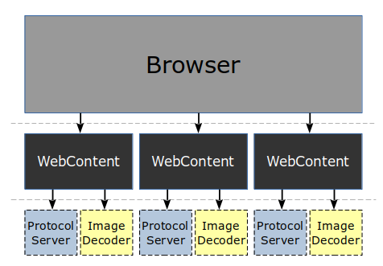
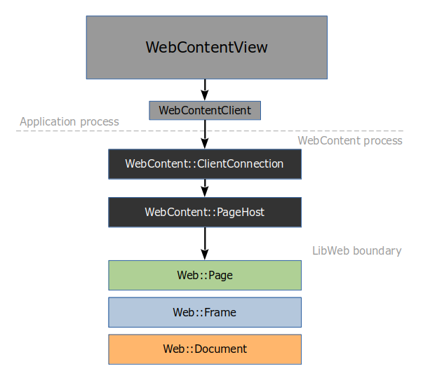

# SerenityOS Browser process architecture

*NOTE: This document is partly aspirational, in that the state of the code does not yet fully reflect what's described here. Implementation is underway.*

The SerenityOS web browser (**"Browser"**) uses a multi-process architecture to improve stability and security in the face of arbitrary (and possibly hostile) web content.

## Process overview

Every instance of the **Browser** application can have one or more tabs open. Each tab has a unique **WebContent** service process spawned on its behalf.

Two important aspects of web browsing are further separated from the **WebContent** process: *network protocols* and *image decoding*, segregated to the **ProtocolServer** and **ImageDecoder** processes respectively.

All processes and are aggressively sandboxed using the `pledge()` and `unveil()` mechanisms. Furthermore, all processes except **Browser** run as an unprivileged user, separate from the primary logged-in desktop user.

### Process: WebContent

This process hosts the main HTML/CSS engine (**LibWeb**.) It also runs JavaScript (**LibJS**.) It gets input events from **Browser** and paints the web content into shared bitmaps. It can only communicate with the outside world via **ProtocolServer**.

### Process: ProtocolServer

This process can speak networking protocols (like HTTP, HTTPS, and Gemini) to the outside world. Each **WebContent** process gets its own **ProtocolServer** to do networking on its behalf.

For DNS lookups, **ProtocolServer** asks for help from the system's global **LookupServer** service, which handles all outgoing DNS requests.

### Process: ImageDecoder

This process can decode images (PNG, JPEG, BMP, ICO, PBM, etc.) into bitmaps. Each image is decoded in a fresh **ImageDecoder** process. These are strongly sandboxed and can't do much except receive encoded bitmap data and return a bitmap to **WebContent** if decoding successful.

### How processes are spawned

To get a fresh **WebContent** process, anyone with the suitable file system permissions can spawn one by connecting to the socket at `/tmp/portal/webcontent`. This socket is managed by **SystemServer** and will spawn a new instance of **WebContent** for every connection.

The same basic concept applies to **ProtocolServer** and **ImageDecoder** as well, except that those services are spawned by **WebContent** as needed, not by **Browser**.

## Class overview

In the GUI application process, a `OutOfProcessWebView` widget is placed somewhere in a window, and it takes care of spawning all of the helper processes, etc.

Internally, the `OutOfProcessWebView` has a `WebContentClient` object that implements the client side of the **WebContent** IPC protocol.

The `WebContentClient` speaks to a `WebContent::ClientConnection` in the **WebContent** process. Internally, the `WebContent::ClientConnection` has a `WebContent::PageHost` which hosts the **LibWeb** engine's main `Web::Page` object.

Inside **LibWeb**, a `Web::Page` has a main `Web::Frame`, which may have subframes corresponding to `<frame>` or `<iframe>` HTML elements. Each `Web::Frame` has a `Web::Document`, which is the root node of the DOM tree.

Describing the **LibWeb** object model in detail is outside the scope of this document.
