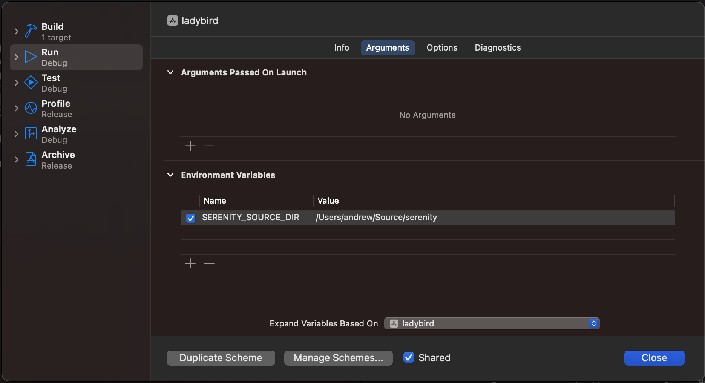

# Ladybird browser build instructions

## Build Prerequisites

Qt6 development packages and a C++20 capable compiler are required. g++-12 or clang-15 are required at a minimum for c++20 support.

On Debian/Ubuntu required packages include, but are not limited to:

```
sudo apt install build-essential cmake libgl1-mesa-dev ninja-build qt6-base-dev qt6-tools-dev-tools qt6-multimedia-dev ccache
```

For Ubuntu 20.04 and above, ensure that the Qt6 Wayland packages are available:

```
sudo apt install qt6-wayland
```

On Arch Linux/Manjaro:

```
sudo pacman -S --needed base-devel cmake libgl ninja qt6-base qt6-tools qt6-wayland qt6-multimedia ccache
```

On Fedora or derivatives:
```
sudo dnf install cmake libglvnd-devel ninja-build qt6-qtbase-devel qt6-qttools-devel qt6-qtwayland-devel qt6-qtmultimedia-devel ccache
```

On openSUSE:
```
sudo zypper install cmake libglvnd-devel ninja qt6-base-devel qt6-multimedia-devel qt6-tools-devel qt6-wayland-devel ccache
```

On Nix/NixOS:
```
nix-shell ladybird.nix
```

On macOS:

Note that Xcode 13.x does not have sufficient C++20 support to build ladybird. Xcode 14 versions before 14.3 might crash while building ladybird. Xcode 14.3 or clang from homebrew may be required to successfully build ladybird.

```
xcode-select --install
brew install cmake qt ninja ccache
```

On OpenIndiana:

Note that OpenIndiana's latest GCC port (GCC 11) is too old to build Ladybird, so you need Clang, which is available in the repository.

```
pfexec pkg install cmake ninja clang-15 libglvnd qt6
```

On Windows:

WSL2/WSLg are preferred, as they provide a linux environment that matches one of the above distributions.
MinGW/MSYS2 are not supported, but may work with sufficient elbow grease. Native Windows builds are not supported with either clang-cl or MSVC.

## Build steps

### Using serenity.sh

The simplest way to build and run ladybird is via the serenity.sh script:

```bash
# From /path/to/serenity
./Meta/serenity.sh run lagom ladybird
./Meta/serenity.sh gdb lagom ladybird
```

By default, the above commands will build Ladybird using Qt for the browser chrome. We also support
the following platform-specific browser chromes:

* [AppKit](https://developer.apple.com/documentation/appkit?language=objc) - The native chrome on macOS.

To build Ladybird using one of these chromes on the appropriate platform, use the following serenity.sh
commands:

```bash
# From /path/to/serenity
./Meta/serenity.sh run lagom ladybird-appkit # Use the AppKit chrome on macOS.
```

### Disabling Ladybird

Note that running ladybird from the script will change the CMake cache in your Build/lagom build
directory to always build LibWeb and Ladybird for Lagom when rebuilding SerenityOS using the
serenity.sh script to run a qemu instance.

To restore the previous behavior that only builds code generators and tools from Lagom when
rebuilding serenity, you must modify the CMake cache back to the default.

```bash
cmake -S Meta/Lagom -B Build/lagom -DENABLE_LAGOM_LADYBIRD=OFF -DENABLE_LAGOM_LIBWEB=OFF -DBUILD_LAGOM=OFF
```

### Resource files

Ladybird requires resource files from the serenity/Base/res directory in order to properly load
icons, fonts, and other theming information. The serenity.sh script calls into custom CMake targets
that set these variables, and ensure that the $PWD is set properly to allow execution from the build
directory. To run the built binary without using the script, one can either directly invoke the
ninja rules, set $SERENITY_SOURCE_DIR to the root of their serenity checkout, or install ladybird
using the provided CMake install rules. See the ``Custom CMake build directory`` section below for
details.

### Custom CMake build directory

If you want to build ladybird on its own, or are interested in packaging ladybird for distribution,
then a separate CMake build directory may be desired. Note that ladybird can be build via the Lagom
CMakeLists.txt, or via the CMakeLists.txt found in the Ladybird directory. For distributions, using
Ladybird as the source directory will give the desired results.

The install rules in Ladybird/cmake/InstallRules.cmake define which binaries and libraries will be
installed into the configured CMAKE_PREFIX_PATH or path passed to ``cmake --install``.

Note that when using a custom build directory rather than Meta/serenity.sh, the user may need to provide
a suitable C++ compiler (g++ >= 12, clang >= 14, Apple Clang >= 14.3) via the CMAKE_CXX_COMPILER and
CMAKE_C_COMPILER cmake options.

```
cmake -GNinja -S Ladybird -B Build/ladybird
# optionally, add -DCMAKE_CXX_COMPILER=<suitable compiler> -DCMAKE_C_COMPILER=<matching c compiler>
cmake --build Build/ladybird
ninja -C Build/ladybird run
```

To automatically run in gdb:
```
ninja -C Build/ladybird debug
```

To run without ninja rule:
```
export SERENITY_SOURCE_DIR=$(realpath ../)
./Build/ladybird/ladybird # or, in macOS: open ./Build/ladybird/ladybird.app
```

### Debugging with CLion

Ladybird should be built with debug symbols first. In `Meta/CMake/lagom_compile_options.cmake` remove the optimizations by changing `-O2` to `-O0`. For macOS also change the debug option from `-g1` to `-g` so that lldb is happy with the emitted symbols. In linux `-g1` can be changed to `-ggdb3` for maximum debug info.

After running Ladybird as suggested above with `./Meta/serenity.sh run lagom ladybird`, you can now in CLion use Run -> Attach to Process to connect. If debugging layouting and rendering issues, filter the listing that opens for `WebContent` and attach to that.

Now breakpoints, stepping and variable inspection will work.

### Debugging with Xcode on macOS

The `serenity.sh` build script does not know how to generate Xcode projects, so creating the project must be done manually.
To be compatible with the script, a few extra options are required. If there is a previous Lagom build directory, CMake will likely complain that the generator has changed.

```
cmake -GXcode -S Meta/Lagom -B Build/lagom -DBUILD_LAGOM=ON -DENABLE_LAGOM_LADYBIRD=ON
```

Alternatively, if you don't need your ladybird build to be compatible with `serenity.sh`, you can use Ladybird as the source directory like so:

```
cmake -GXcode -S Ladybird -B Build/ladybird
```

After generating an Xcode project into the specified build directory, you can open `ladybird.xcodeproj` in Xcode. The project has a ton of targets, many of which are generated code.
The only target that needs a scheme is the ladybird app bundle.

In order for the application to launch properly through Xcode, the `SERENITY_SOURCE_DIR` environment variable must be set to your serenity checkout in the ladybird scheme, per the
screenshot below. The same is true for profiling the application in Instruments. Future updates might fill out the application bundle such that the environment variable is not required.




### Building on OpenIndiana

OpenIndiana needs some extra environment variables set to make sure it finds all the executables
and directories it needs for the build to work. The cmake files are in a non-standard path that
contains the Qt version (replace 6.2 with the Qt version you have installed) and you need to tell
it to use clang and clang++, or it will use gcc and g++ from GCC 10 which is currently the default
to build packages on OpenIndiana.

When running Ladybird, make sure that XDG_RUNTIME_DIR is set, or it will immediately crash as it
doesn't find a writable directory for its sockets.

```
CMAKE_PREFIX_PATH=/usr/lib/qt/6.2/lib/amd64/cmake cmake -GNinja -S Ladybird -B Build/ladybird -DCMAKE_C_COMPILER=/usr/bin/clang -DCMAKE_CXX_COMPILER=/usr/bin/clang++
cmake --build Build/ladybird
XDG_RUNTIME_DIR=/var/tmp ninja -C Build/ladybird run
```
