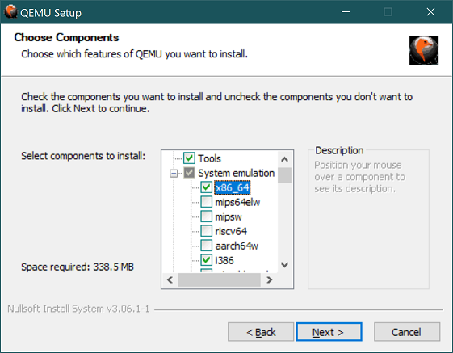

# Setting up a development environment on Windows

SerenityOS can be built and run under WSL Version 2.
WSL Version 1 is not supported since Version 1 does not support ext2, which is needed for the setup.

WSL Version 2 requires Windows 10 version 2004 or higher, with OS Build 19041 or greater. Here is a guide on how to
[get WSL2](https://docs.microsoft.com/en-us/windows/wsl/install-win10).

Once installed, you will need to make sure the distribution you want to use (and the new default) is using Version 2:
- `wsl -l -v` lists distros and versions, 
- `wsl --set-version <distro> <version>` is used to convert a distro to another version, and 
- `wsl --set-default-version 2` will set the default version for all new distros (if desired.) 

## Setting up build tools

Please see the general build instructions for a list of tools you need to install in your WSL Linux environment. As a
special exception you should _not_ install QEMU in the Linux environment and instead use the instructions from the next
section to set up QEMU on your host system.

## Setting up QEMU

- Grab the latest QEMU binaries from [here](https://www.qemu.org/download/#windows) and install them. At a minimum you
will need to install the tools as well as the system emulators for i386 and x86_64.

- Locate the executable `qemu-system-x86_64.exe` in WSL.
By default this will be located at `/mnt/c/Program Files/qemu/qemu-system-x86_64.exe`.

- Set the `SERENITY_QEMU_BIN` environment variable to the location above. For example: \
`export SERENITY_QEMU_BIN='/mnt/c/Program Files/qemu/qemu-system-x86_64.exe'`

- Set the `SERENITY_KERNEL_CMDLINE` environment variable to disable VirtIO support (Because it is currently broken on
  native windows QEMU):
`export SERENITY_KERNEL_CMDLINE="disable_virtio"`

- `ninja run` as usual.

### Hardware acceleration

The steps above will run QEMU in software virtualisation mode, which is very slow.
QEMU supports hardware acceleration on Windows via the [Windows Hypervisor Platform](https://docs.microsoft.com/en-us/virtualization/api/) (WHPX), a user-mode virtualisation API that can be used alongside Hyper-V.
This is important to note as WSL2 itself runs on top of Hyper-V, which conflicts with other acceleration technologies
such as Intel HAXM.

To run SerenityOS in a WHPX-enabled QEMU VM:

- If you have not already done so, enable Windows Hypervisor Platform, either using "Turn Windows features on or off",
  or by running the following command in an elevated PowerShell session: \
`dism /Online /Enable-Feature /All /FeatureName:HypervisorPlatform`

- Specify QEMU acceleration option: \
`export SERENITY_VIRT_TECH_ARG="-accel whpx,kernel-irqchip=off"`

- Disable Virtual Machine eXtensions on the vCPU, otherwise some versions of QEMU will crash out with a "WHPX: Unexpected VP exit code 4" error: \
`export SERENITY_QEMU_CPU="max,vmx=off"`

- `ninja run` as usual.

### Known issues with WHPX

#### Freeze on boot in Scheduler

If Serenity freezes on boot with the log message: `Scheduler[0]: idle loop running` then you are likely missing some emulated CPU features.
Please ensure you have installed the most recent version of [QEMU for Windows](https://qemu.weilnetz.de/) and that you
have followed the step above to enable the maximum feature set available: `export SERENITY_QEMU_CPU="max,vmx=off"`.

If the steps above do not fix the problem, check the boot log for `whpx: injection failed, MSI (0, 0) delivery: 0, dest_mode: 0, trigger mode: 0, vector: 0, lost (c0350005)`.
If present, try disabling the KVM in-kernel interrupt handler by extending the above to `export SERENITY_EXTRA_QEMU_ARGS="-accel whpx,kernel-irqchip=off"`.
This seems to be an issue for some users with QEMU 6.x.

#### Illegal instruction on boot

Using `SERENITY_QEMU_CPU="max"` can trigger a QEMU bug where the OSXSAVE CPUID flag is erroneously set, playing havoc
with feature detection logic in libgcc and resulting in this error.

To workaround this, first adjust the `SERENITY_QEMU_CPU` setting to emulate a more restricted feature set. `SERENITY_QEMU_CPU="qemu32"`
appears to work in some cases, however in others causes the boot freeze issue above. It's worth playing around with
various different values here to see if you can find one that works for you. Running `qemu-system-x86_64.exe -cpu ?` will
list the supported CPU configurations.

If you cannot find a working CPU feature set, the next workaround is to patch libgcc in the Serenity toolchain build to
remove the offending instruction.
Comment out the `if ((ecx & bit_OSXSAVE))` block in `Toolchain/Tarballs/gcc-<version>/libgcc/config/i386/cpuinfo.c`. In
GCC 10.2.0 this is lines 282-297.

Rebuild the toolchain using `Toolchain/BuildIt.sh` as normal, then rebuild Serenity.

#### Slow boot on HiDPI systems

On some Windows systems running with >100% scaling, the booting phase of Serenity might slow to a crawl. Changing the
zoom settings of the QEMU window will speed up the emulation, but you'll have to squint harder to read the smaller display.

A quick workaround is opening the properties of the QEMU executable at `C:\Program Files\qemu\qemu-system-x86_64.exe`, and
in the Compatibility tab changing the DPI settings to force the scaling to be performed by the System, by changing the
setting at at the bottom of the window. The QEMU window will now render at normal size while retaining acceptable emulation speeds.

This is being tracked as issue [#7657](https://github.com/SerenityOS/serenity/issues/7657).

## Note on filesystems

WSL2 filesystem performance for IO heavy tasks (such as compiling a large C++ project) on the host Windows filesystem is
terrible. This is because WSL2 runs as a Hyper-V virtual machine and uses the 9P file system protocol to access host
Windows files, over Hyper-V sockets.

For a more in depth explanation of the technical limitations of their approach, see
[this issue on the WSL GitHub project](https://github.com/microsoft/WSL/issues/4197#issuecomment-604592340)

The recommendation from the Microsoft team on that issue is:

> If it's at all possible, store your projects in the Linux file system in WSL2.

In practice, this means cloning and building the project to somewhere such as `/home/username/serenity`.

If you're using the native Windows QEMU binary from the above steps, QEMU is not able to access the ext4 root partition
of the WSL2 installation without going via the 9P network file share. The root of your WSL2 distro will begin at the
network path `\\wsl$\{distro-name}`.

Alternatively, you may prefer to copy `Build/_disk_image` and `Build/Kernel/Kernel` to a native Windows partition (e.g.
`/mnt/c`) before running `ninja run`, in which case `SERENITY_DISK_IMAGE` will be a regular Windows path (e.g.
`'D:\serenity\_disk_image'`).
