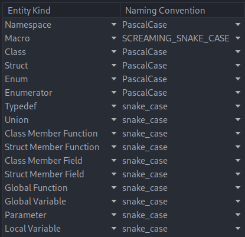

## CLion Project Configuration

CLion can integrate with CMake to provide code comprehension features.

After opening the `serenity` repository in CLion as a new project, the "`Open Project Wizard`" window will open, from here set the following fields:

(Assuming you use `Ninja` as the build system and configured the CMake build directory to `Build/i686`)

`Build type`: `Default`

> _CMake will complain with any other build type, make sure to use `Default` so that `CMAKE_BUILD_TYPE` is empty in the `Build/i686/CMakeCache.txt` file._

`CMake Options`:
```
-GNinja
-DCMAKE_TOOLCHAIN_FILE=$CMakeProjectDir$/Build/i686/CMakeToolchain.txt
-DCMAKE_PREFIX_PATH=$CMakeProjectDir$/Build/lagom-install
-DSERENITY_ARCH=i686
```

> CLion will complain that the toolchain file doesn't exist yet, if you haven't `cmake` for the SuperBuild step before. The SuperBuild configure step creates the Toolchain file.
> To re-create the file after blasting your build directory, run `cmake -GNinja -S Meta/CMake/Superbuild -B Build/superbuild-i686` from the top level in a terminal, or simply run `./Meta/serenity.sh run`

`Build Directory`: `Build/i686`

> _If you have not built the Toolchain at this point, please do so: `./Toolchain/BuildIt.sh`_

> _If you have not built host tools from Lagom at this point, please do so: `./Meta/serenity.sh build` or `ninja -C Build/superbuild-i686` after running `cmake -GNinja -S Meta/CMake/Superbuild -B Build/superbuild-i686`_

If you already have the project open, you can go to `File -> Settings -> Build, Execution, Deployment -> CMake` to find these options.

## Excluding Build Artifacts

Source files are copied to the `Build` directory during the build, if you do not exclude them from CLion indexing they will show up
in search results. This is often confusing, unintuitive, and can result in you losing changes you have made to files. To exclude
these files navigate to the `Project` tool window, right-click the `Build` folder and select `Mark Directory as | Excluded`. If you
want exclude Toolchain files as well, follow the same procedure with the following paths:
- `Toolchain/Local`
- `Toolchain/Tarballs`
- `Toolchain/Build`

## Include headers and source files for code insight

To get proper code insight mark the folders `AK`, `Kernel` and `Userland` by right-clicking on them and selecting `Mark Directory as | Project Sources and Headers`.

A symptom of this not being configured correctly is CLion giving a warning for every single file: 
> The file does not belong to any project target, code insight features might not work properly.

## Code Generation Settings

To make code generated by CLion (e.g. identifier names, const placement) match the SerenityOS coding style, change the
following options under `Settings -> Editor -> Code Style -> C/C++`:

- On the `Code Generation` tab set `const/volatile qualifier placement` to `int const x = 0`
- On the `Naming Convention` tab, select the following:

  

## Notes for WSL Users

It is possible to set the embedded terminal in CLion to the one that your WSL distribution provides.
This way you can build and run serenity without leaving the IDE.
Note that following will only help if you don't use an X-window server to access qemu.
It is possible to install qemu natively on Windows and allow WSL to use it instead of installing qemu first on (wsl) linux and then use X server to launch serenity inside of it.
Check the updated manual [here](BuildInstructionsWindows.md).

- Locate the terminal emulator for your linux distribution.
Open CMD with elevated privileges and cd to `C:/Program Files/WindowsApps/`.
The directory is usually hidden and requires additional privileges. You should be able to cd as administrator.
`dir` and look for your distribution in directory names. In case of Ubuntu, it starts with `CanonicalGroupLimited.Ubuntu20.04onWindows_2004.2020.424.0_x64`.
cd to it. The directory should contain the shell executable. In my case it's named `ubuntu2004.exe`.
Copy `absolute/path/to/ubuntu2004.exe`.

- Go to your IDE settings: `File->Settings->Tools->Terminal` and paste the path you just copied to `shell path`. Click OK.

- Close CLion and restart.

The default IDE terminal should now be changed to WSL, and now you can run `CLion/run.sh`.
You may also want to copy `serenity/Meta/CLion/run.sh` to your project directory and run it from there, so that you don't have to fight with git every time you modify the script.
