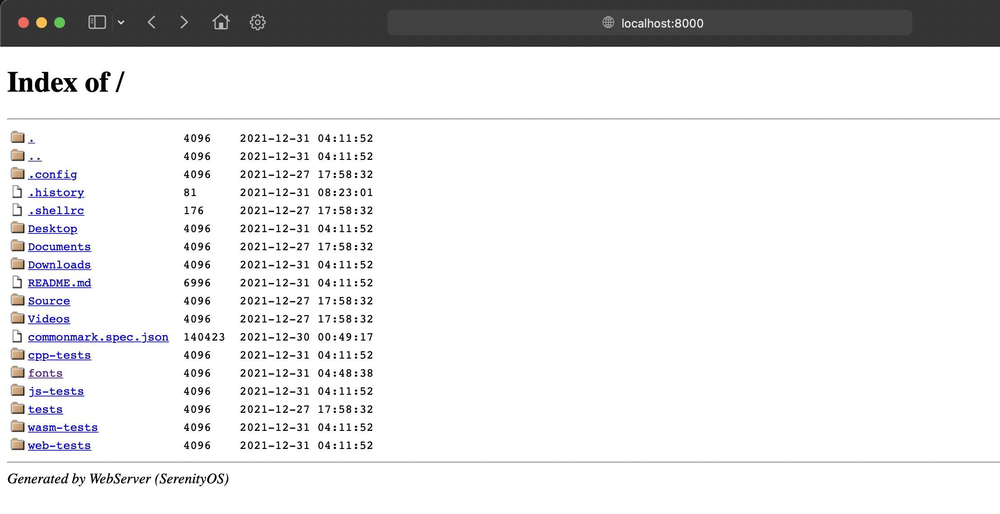

# Transferring files from QEMU to your host machine

## Method 1: WebServer
Serenity has a built-in web server which extends to your host machine.

Open a new terminal and use the following command to start a WebServer instance for the current working directory:

```console
ws .
```

Then we just open `localhost:8000` on our host machine :^)



**NOTE:** Due to the fact that some browsers download unrecognized files as plain text, you may want to use something like `wget` to download the file **as is** instead. Otherwise the file may appear corrupted when the system tries to load it.

## Method 2: Mount the disk image

Another way is to mount Serenity's `_disk_image` to your host machine by using the following command on *nix systems (or inside WSL):

```console
cd "Build/${SERENITY_ARCH}"
mkdir mnt
sudo mount -t ext2 _disk_image mnt
```

## Method 3: Archiving tool with ext2 support

Some archiving tools, like [7-Zip](https://www.7-zip.org/), are capable of directly opening ext2 images like Serenity's `_disk_image`. With these, you can open the disk image like any other archive and extract the files you need.

For WSL users: If you have the image on your native WSL drive (recommended), this drive can be opened in Explorer by manually opening `\\wsl$` (not visible in the Network tab!) and then the "network share" corresponding to your distro.
