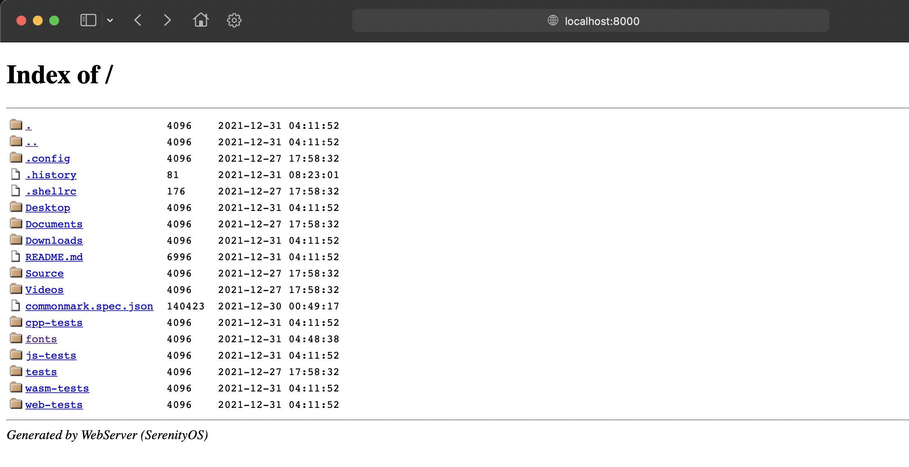

# Transferring files from QEMU to your host machine

## Method 1: WebServer

Serenity has a built-in web server which extends to your host machine.

Open a new terminal and use the following command to start a WebServer instance for the current working directory:

```console
ws .
```

Then we just open `localhost:8000` on our host machine :^)



**NOTE:** Due to the fact that some browsers download unrecognized files as plain text, you may want to use something like `wget` to download the file **as is** instead. Otherwise the file may appear corrupted when the system tries to load it.

## Method 2: Mount the disk image

Another way is to mount Serenity's `_disk_image` to your host machine by using the following command on \*nix systems (or inside WSL):

```console
cd "Build/${SERENITY_ARCH}"
mkdir mnt
sudo mount -t ext2 _disk_image mnt
```

## Method 3: Archiving tool with ext2 support

Some archiving tools, like [7-Zip](https://www.7-zip.org/), are capable of directly opening ext2 images like Serenity's `_disk_image`. With these, you can open the disk image like any other archive and extract the files you need.

For WSL users: If you have the image on your native WSL drive (recommended), this drive can be opened in Explorer by manually opening `\\wsl$` (not visible in the Network tab!) and then the "network share" corresponding to your distro.

## Method 4: Enable OpenSSH on host and use sftp client on SerenityOS

-   Setup OpenSSH server on your host.
    For windows: Google is your friend (https://docs.microsoft.com/en-us/windows-server/administration/openssh/openssh_install_firstuse)
    For linux: Google is your friend.
-   Ensure that you already have a working SerenityOS working build.

```console
$ Meta/serenity.sh rebuild-world
```

-   To enable OpenSSH package from SerenityOS: (initial directory is SerenityOS ROOT_DIR)

```console
cd Ports
cd openssh
./package.sh
cd ../..
Meta/serenity.sh run
```

-   From within SerenityOS, check that you have a working sftp app:

```console
courage:~ $ sftp
```

The expected response will be:

```console
courage:~ $ sftp
usage: sftp [-46aCfNpqrv] [-B buffer_size] [-b batchfile] [-c cipher]
          [-D sftp_server_path] [-F ssh_config] [-i identity_file]
          [-J destination] [-l limit] [-o ssh_option] [-P port]
          [-R num_requests] [-S program] [-s subsystem | sftp_server]
          destination
```

-   Assume that you have a working OpenSSH server as mentioned earlier, with an IP address of 192.168.0.11.
-   Assume that you have a valid user on that host with account name user1.
-   Assume that you are currently inside the folder from which you want to transfer the file(s) from.
-   Local
    User: anon
-   Remote
    User: user1
    IP Address: 192.168.0.11
-   Connect to remote server via sftp

```console
courage:~ $ sftp user1@192.168.0.11
The authenticity of host '(192.168.0.11)' can't be established.
ECDSA key finger print is SHA256:Iav!m/E0cHJBnzSk0hJEZnBZ2F3LBL4wxhyv4nrfPtU.
Are you sure you want to continue connecting (yes/no/[fingerprint])? yes

user1@'s password:
Connected to 192.168.0.11

```

-   By this time, you have successfully connected and logged on to the remote host.
-   You can get more information by typing `help`.
-   The most often used (simplified) sftp commands are `ls`, `cd`, `put [filename]`, `get [filename]`, and `quit`. I said simplified since the actual commands have many more options.
-   Be aware that there will be a time you would think that nothing is happening since the cursor just stares back at you. It is always waiting for your next instruction. Typing `quit` or `bye` will close the program.
-   Congratulations. Pat yourself at the back.
