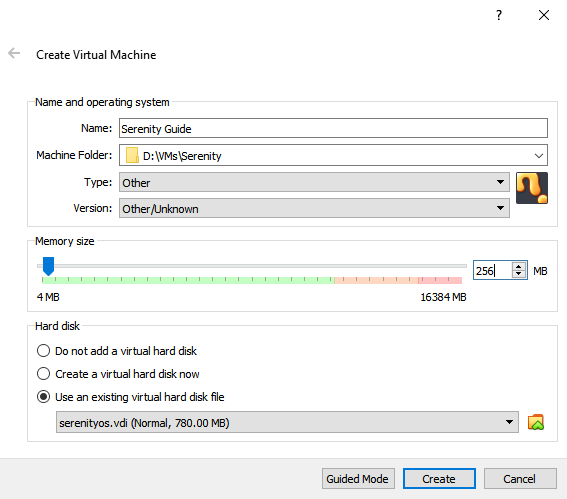

# Serenity installation guide for VirtualBox

## NOTICE
There are currently issues with running Serenity in VirtualBox. Please refer to the [open issue](https://github.com/SerenityOS/serenity/issues/2927) for a list of currently known issues. Anything that doesn't currently work will be noted in this document.

## Creating the disk image
Before creating a disk image that will work in VirtualBox, you will need to create a GRUB image as described in the [Serenity installation guide](https://github.com/SerenityOS/serenity/blob/master/Documentation/INSTALL.md). Please skip the final step of that section, as that is only relevant for putting the image onto a real drive. You **cannot** use the same disk image created for QEMU. Using that image will halt immediately with the message ``FATAL: No bootable medium found! System halted.``

There are a couple of ways to convert the disk image:

If you have QEMU installed:
``
qemu-img convert -O vdi /path/to/grub_disk_image /path/to/output/serenityos.vdi
``

If you only have VirtualBox installed:
``
VBoxManage convertfromraw --format VDI /path/to/grub_disk_image /path/to/output/serenityos.vdi
``

Note that if you are on Windows and you do not have QEMU or VirtualBox in your PATH environment variable, you must be in the installation folder for the tool you're using. You will also need to put ``./`` in front of the command.

## Creating the virtual machine
**Please note that these instructions were written with VirtualBox v6.1.12 in mind. Therefore, these instructions may not match exactly for past and future versions.**

1. Open the **Create Virtual Machine** dialog. Switch to **Expert Mode**.
2. Feel free to give it any name and store it anywhere.
3. Switch the **Type** to **Other** and the **Version** to **Other/Unknown**.
4. Serenity requires at minimum 32 MB of memory. Set **Memory size** equal to or above 32 MB. The currently recommended size is 256 MB. Please note that Serenity is currently a 32-bit system, so anything above the ~3.5 GB mark will not be recognized.
5. For **Hard disk**, select **Use an existing virtual hard disk file**. Click the folder icon next to the dropdown to open the **Hard Disk Selector**.
6. Click **Add**. Browse to where you stored the converted disk image from the previous stage and add it. Click **Choose**.
7. Finally click **Create**.

Reference image:

## Note on updating the disk image
When you go to update the disk image in the future and replace the current VDI, you will notice the virtual machine will no longer boot. This is because VirtualBox gives an identifier to the disk image, and changing the disk image makes the identifiers no longer match up.

You will also notice that you cannot remove disk images from the **Hard Disk Selector**.

The way around this is to use a different file name for each VDI you generate. You will then have to:
1. Open **Settings** and go to **Storage**.
2. Right click the current drive and click **Remove Attachment**.
3. Click on the **Controller** and then click the add hard disk icon. Add the new VDI and click **Choose**.
4. You should see the new drive attached. Make sure **Hard Disk** is set to **IDE Primary Master**.

Yes, this is a mess. You can delete the old disk images without any issues. If you know a solution for this, *please* let us know.

## Configuring the virtual machine to boot Serenity
Serenity will not be able to boot with the default configuration. There are a couple settings to adjust. Open **Settings** and: 
1. Go to **System**, open the **Processor** tab and tick **Enable PAE/NX**.
2. Go to **Audio** and set **Audio Controller** to **SoundBlaster 16**.

There are a couple of settings to check:
- In **Storage**, click on the **Controller**. Make sure the controller type is PIIX4. PIIX3 and ICH6 are untested. Anything else is guaranteed not to work, as Serenity does not currently support them.
- In **Network** and in the **Advanced** drop down, make sure the **Adapter Type** is anything but **Intel PRO/1000 MT Desktop (82540EM)**. While it is the only adapter type Serenity currently supports, it does not currently work in VirtualBox.

Please note that at the time of writing, audio and networking do not work in VirtualBox.

That is all you need to boot Serenity in VirtualBox! Read on for additional configuration you may want to use.

## Additional configuration (optional)
For serial debugging, go to **Serial Ports** and enable port 1. Feel free to set the **Port Mode** to anything if you know what you're doing. The recommended mode is **Raw File**. Set **Path/Address** to where you want to store the file. This must also include the file name.

While the default 16 MB of video memory is more than enough to use the default resolution, it is not enough to use all the supported resolutions. If you want to use 2560x1080, you will need to supply at minimum 22 MB of video memory.
