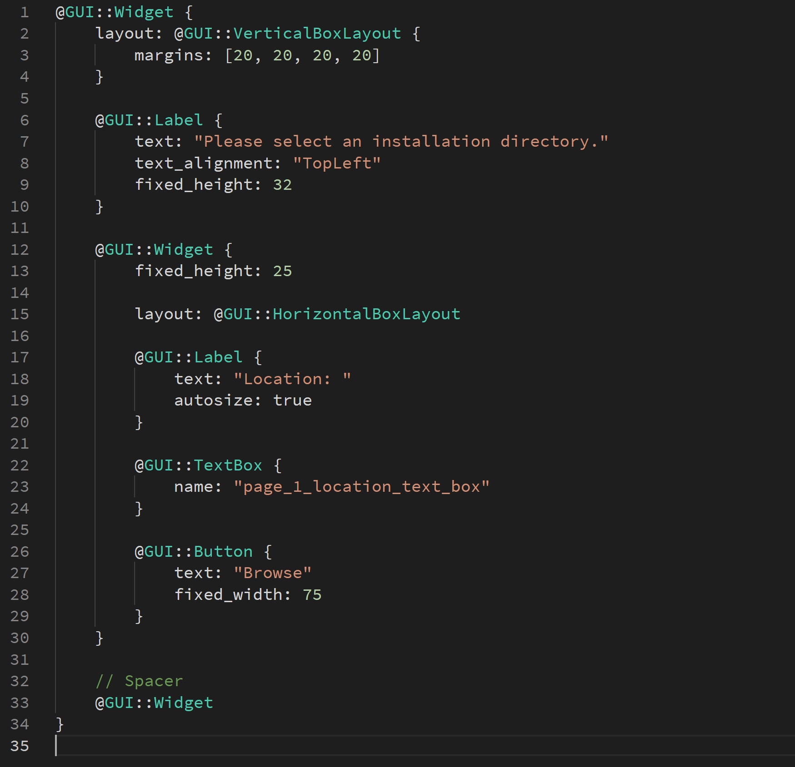
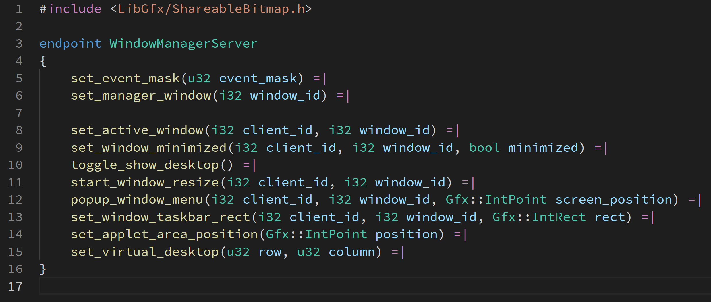
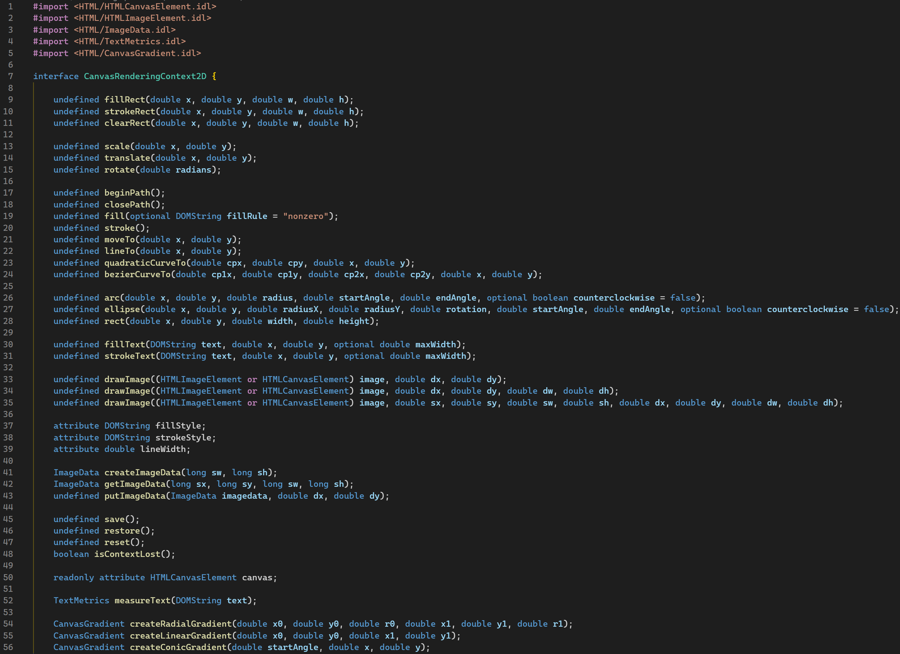
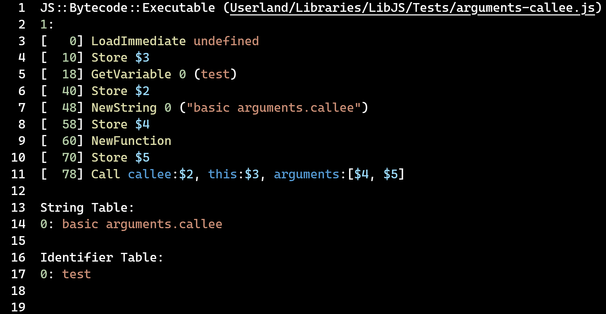

# Syntax highlighting for SerenityOS DSLs

Syntax highlighting for SerenityOS' Domain Specific Languages:

-   `.ipc`: Endpoint specification for the Inter Process Communication protocol.
-   `.gml`: Graphical Markup Language for creating SerenityOS GUI application layouts.
-   `.idl`: [Web-IDL](https://webidl.spec.whatwg.org/) which SerenityOS's LibWeb directly uses to generate web API bindings.
-   The [LibJS](https://libjs.dev) Bytecode serialization format (no extension) as output by `js` with the `-d` option.

## Installing

This extension is not currently published to any marketplace. Instead, build and run it yourself, just like SerenityOS. You will need `npm` and `npx`. See also [this guide](https://code.visualstudio.com/api/working-with-extensions/publishing-extension).

```shell
# Install the dependencies
npm install
# Create an extension package
npx @vscode/vsce package
```

This will create a `.vsix` package named `serenity-dsl-syntaxhighlight-<version>.vsix`. You can now install this file manually through the VSCode UI, or with `code --install-extension serenity-dsl-syntaxhighlight-<version>.vsix`.

## Features

Provides TextMate Grammar-based syntax highlighting for the IPC and GML languages, as well as the LibJS Bytecode serialization format. Syntax highlighting is mostly compliant with SerenityOS' own syntax highlighters (in the case of GML) and code generators (in the case of IPC).

Additionally it provides TextMate Grammar-based syntax highlighting for [Web-IDL](https://webidl.spec.whatwg.org/) with all extensions to it that SerenityOS uses.

### GML syntax highlighting



### IPC syntax highlighting



### Web IDL syntax highlighting



### LibJS Bytecode serialization highlighting



### GML formatting

Allows formatting GML files with SerenityOS's own GML formatter. This is accomplished via the Lagom build of gml-format, so in order for the formatter to work, you need to build Lagom (see the options for the `Meta/serenity.sh` main script) and your workspace directory needs to be the Serenity root itself in order for the GML formatter to be found under Build/lagom/gml-format.

## Known Issues

### GML

GML uses the .gml extension, which is also used for the GameMaker language. You may have to set the language for each file manually.

The GML formatter needs to save the file in order to format it, so formatting and keeping a file unsaved is not currently possible.

### Web-IDL

-   Extended attribute highlighting may not be spec-compliant.

### LibJS Bytecode

-   It does not have an extension
-   Auto-detection does not seem to work, instead it is usually detected as Markdown
