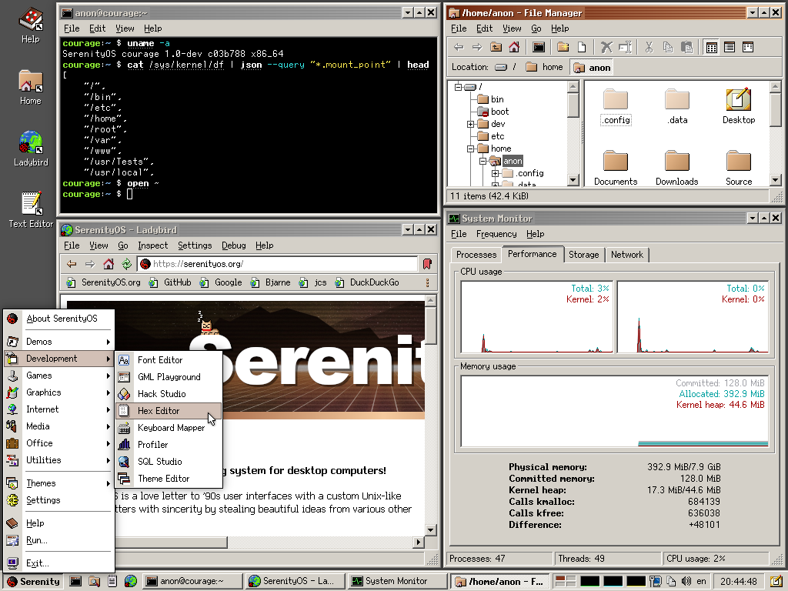

# SerenityOS

Graphical Unix-like operating system for 64-bit x86, Arm, and RISC-V computers.

[FAQ](Documentation/FAQ.md) | [Documentation](#how-do-i-read-the-documentation) | [Build Instructions](#how-do-i-build-and-run-this)

## About

SerenityOS is a love letter to '90s user interfaces with a custom Unix-like core. It flatters with sincerity by stealing beautiful ideas from various other systems.

Roughly speaking, the goal is a marriage between the aesthetic of late-1990s productivity software and the power-user accessibility of late-2000s \*nix. This is a system by us, for us, based on the things we like.

You can watch videos of the system being developed on YouTube:

-   [Andreas Kling's channel](https://youtube.com/andreaskling)
-   [Linus Groh's channel](https://youtube.com/linusgroh)
-   [kleines Filmröllchen's channel](https://www.youtube.com/c/kleinesfilmroellchen)

## Screenshot

## Features

-   Modern 64-bit kernel with pre-emptive multi-threading
-   [Browser](Userland/Applications/Browser/) with JavaScript, WebAssembly, and more (check the spec compliance for [JS](https://serenityos.github.io/libjs-website/test262/), [CSS](https://css.tobyase.de/), and [Wasm](https://serenityos.github.io/libjs-website/wasm/))
-   Security features (hardware protections, limited userland capabilities, W^X memory, `pledge` & `unveil`, (K)ASLR, OOM-resistance, web-content isolation, state-of-the-art TLS algorithms, ...)
-   [System services](Userland/Services/) (WindowServer, LoginServer, AudioServer, WebServer, RequestServer, CrashServer, ...) and modern IPC
-   Good POSIX compatibility ([LibC](Userland/Libraries/LibC/), Shell, syscalls, signals, pseudoterminals, filesystem notifications, standard Unix [utilities](Userland/Utilities/), ...)
-   POSIX-like virtual file systems (/proc, /dev, /sys, /tmp, ...) and ext2 file system
-   Network stack and applications with support for IPv4, TCP, UDP; DNS, HTTP, Gemini, IMAP, NTP
-   Profiling, debugging and other development tools (Kernel-supported profiling, CrashReporter, interactive GUI playground, HexEditor, HackStudio IDE for C++ and more)
-   [Libraries](Userland/Libraries/) for everything from cryptography to OpenGL, audio, JavaScript, GUI, playing chess, ...
-   Support for many common and uncommon file formats (PNG, JPEG, GIF, MP3, WAV, FLAC, ZIP, TAR, PDF, QOI, Gemini, ...)
-   Unified style and design philosophy, flexible theming system, [custom (bitmap and vector) fonts](https://fonts.serenityos.net/font-family)
-   [Games](Userland/Games/) (Solitaire, Minesweeper, 2048, chess, Conway's Game of Life, ...) and [demos](Userland/Demos/) (CatDog, Starfield, Eyes, mandelbrot set, WidgetGallery, ...)
-   Every-day GUI programs and utilities (Spreadsheet with JavaScript, TextEditor, Terminal, PixelPaint, various multimedia viewers and players, Mail, Assistant, Calculator, ...)

... and all of the above are right in this repository, no extra dependencies, built from-scratch by us :^)

Additionally, there are [over three hundred ports of popular open-source software](Ports/AvailablePorts.md), including games, compilers, Unix tools, multimedia apps and more.

## How do I read the documentation?

Man pages are available online at [man.serenityos.org](https://man.serenityos.org). These pages are generated from the Markdown source files in [`Base/usr/share/man`](https://github.com/SerenityOS/serenity/tree/master/Base/usr/share/man) and updated automatically.

When running SerenityOS you can use `man` for the terminal interface, or `help` for the GUI.

Code-related documentation can be found in the [documentation](Documentation/) folder.

## How do I build and run this?

See the [SerenityOS build instructions](https://github.com/SerenityOS/serenity/blob/master/Documentation/BuildInstructions.md) or the [Ladybird build instructions](Documentation/BuildInstructionsLadybird.md).

The build system supports a cross-compilation build of SerenityOS from Linux, macOS, Windows (with WSL2) and many other \*Nixes.
The default build system commands will launch a QEMU instance running the OS with hardware or software virtualization
enabled as supported.

Ladybird runs on the same platforms that can be the host for a cross build of SerenityOS and on SerenityOS itself.

## Get in touch and participate!

Join our Discord server: [SerenityOS Discord](https://discord.gg/serenityos)

Before opening an issue, please see the [issue policy](https://github.com/SerenityOS/serenity/blob/master/CONTRIBUTING.md#issue-policy).

A general guide for contributing can be found in [`CONTRIBUTING.md`](CONTRIBUTING.md).

## Authors

-   **Andreas Kling** - [awesomekling](https://twitter.com/awesomekling) 
-   **Robin Burchell** - [rburchell](https://github.com/rburchell)
-   **Conrad Pankoff** - [deoxxa](https://github.com/deoxxa)
-   **Sergey Bugaev** - [bugaevc](https://github.com/bugaevc)
-   **Liav A** - [supercomputer7](https://github.com/supercomputer7)
-   **Linus Groh** - [linusg](https://github.com/linusg) 
-   **Ali Mohammad Pur** - [alimpfard](https://github.com/alimpfard)
-   **Shannon Booth** - [shannonbooth](https://github.com/shannonbooth)
-   **Hüseyin ASLITÜRK** - [asliturk](https://github.com/asliturk)
-   **Matthew Olsson** - [mattco98](https://github.com/mattco98)
-   **Nico Weber** - [nico](https://github.com/nico)
-   **Brian Gianforcaro** - [bgianfo](https://github.com/bgianfo)
-   **Ben Wiederhake** - [BenWiederhake](https://github.com/BenWiederhake)
-   **Tom** - [tomuta](https://github.com/tomuta)
-   **Paul Scharnofske** - [asynts](https://github.com/asynts)
-   **Itamar Shenhar** - [itamar8910](https://github.com/itamar8910)
-   **Luke Wilde** - [Lubrsi](https://github.com/Lubrsi)
-   **Brendan Coles** - [bcoles](https://github.com/bcoles)
-   **Andrew Kaster** - [ADKaster](https://github.com/ADKaster) 
-   **thankyouverycool** - [thankyouverycool](https://github.com/thankyouverycool)
-   **Idan Horowitz** - [IdanHo](https://github.com/IdanHo)
-   **Gunnar Beutner** - [gunnarbeutner](https://github.com/gunnarbeutner)
-   **Tim Flynn** - [trflynn89](https://github.com/trflynn89)
-   **Jean-Baptiste Boric** - [boricj](https://github.com/boricj)
-   **Stephan Unverwerth** - [sunverwerth](https://github.com/sunverwerth)
-   **Max Wipfli** - [MaxWipfli](https://github.com/MaxWipfli)
-   **Daniel Bertalan** - [BertalanD](https://github.com/BertalanD)
-   **Jelle Raaijmakers** - [GMTA](https://github.com/GMTA)
-   **Sam Atkins** - [AtkinsSJ](https://github.com/AtkinsSJ) 
-   **Tobias Christiansen** - [TobyAsE](https://github.com/TobyAsE)
-   **Lenny Maiorani** - [ldm5180](https://github.com/ldm5180)
-   **sin-ack** - [sin-ack](https://github.com/sin-ack)
-   **Jesse Buhagiar** - [Quaker762](https://github.com/Quaker762)
-   **Peter Elliott** - [Petelliott](https://github.com/Petelliott)
-   **Karol Kosek** - [krkk](https://github.com/krkk)
-   **Mustafa Quraish** - [mustafaquraish](https://github.com/mustafaquraish)
-   **David Tuin** - [davidot](https://github.com/davidot)
-   **Leon Albrecht** - [Hendiadyoin1](https://github.com/Hendiadyoin1)
-   **Tim Schumacher** - [timschumi](https://github.com/timschumi)
-   **Marcus Nilsson** - [metmo](https://github.com/metmo)
-   **Gegga Thor** - [Xexxa](https://github.com/Xexxa) 
-   **kleines Filmröllchen** - [kleinesfilmroellchen](https://github.com/kleinesfilmroellchen) 
-   **Kenneth Myhra** - [kennethmyhra](https://github.com/kennethmyhra)
-   **Maciej** - [sppmacd](https://github.com/sppmacd)
-   **Sahan Fernando** - [ccapitalK](https://github.com/ccapitalK)
-   **Benjamin Maxwell** - [MacDue](https://github.com/MacDue)
-   **Dennis Esternon** - [djwisdom](https://github.com/djwisdom) 
-   **frhun** - [frhun](https://github.com/frhun)
-   **networkException** - [networkException](https://github.com/networkException) 
-   **Brandon Jordan** - [electrikmilk](https://github.com/electrikmilk)
-   **Lucas Chollet** - [LucasChollet](https://github.com/LucasChollet)
-   **Timon Kruiper** - [FireFox317](https://github.com/FireFox317)
-   **Martin Falisse** - [martinfalisse](https://github.com/martinfalisse)
-   **Gregory Bertilson** - [Zaggy1024](https://github.com/Zaggy1024)
-   **Erik Wouters** - [EWouters](https://github.com/EWouters)
-   **Rodrigo Tobar** - [rtobar](https://github.com/rtobar)
-   **Alexander Kalenik** - [kalenikaliaksandr](https://github.com/kalenikaliaksandr)
-   **Tim Ledbetter** - [tcl3](https://github.com/tcl3)
-   **Steffen T. Larssen** - [stelar7](https://github.com/stelar7)
-   **Andi Gallo** - [axgallo](https://github.com/axgallo)
-   **Simon Wanner** - [skyrising](https://github.com/skyrising)
-   **FalseHonesty** - [FalseHonesty](https://github.com/FalseHonesty)
-   **Bastiaan van der Plaat** - [bplaat](https://github.com/bplaat)
-   **Dan Klishch** - [DanShaders](https://github.com/DanShaders)
-   **Julian Offenhäuser** - [janso3](https://github.com/janso3)
-   **Sönke Holz** - [spholz](https://github.com/spholz)
-   **implicitfield** - [implicitfield](https://github.com/implicitfield)

And many more! [See here](https://github.com/SerenityOS/serenity/graphs/contributors) for a full contributor list. The people listed above have landed more than 100 commits in the project. :^)

## License

SerenityOS is licensed under a 2-clause BSD license.
