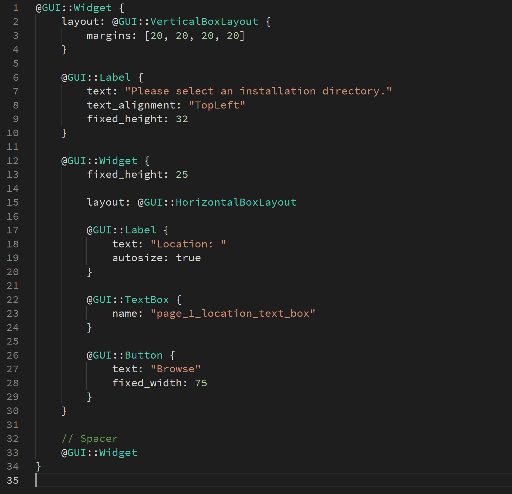
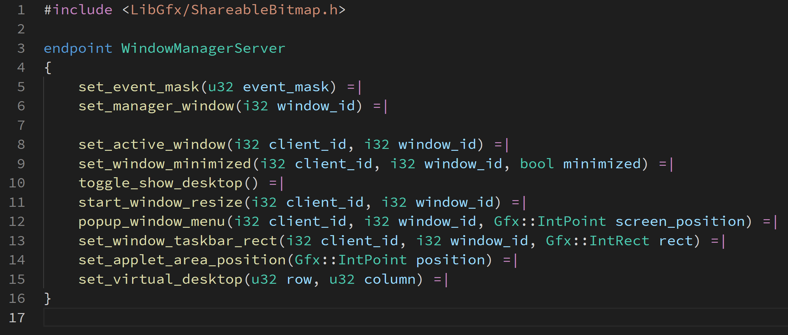
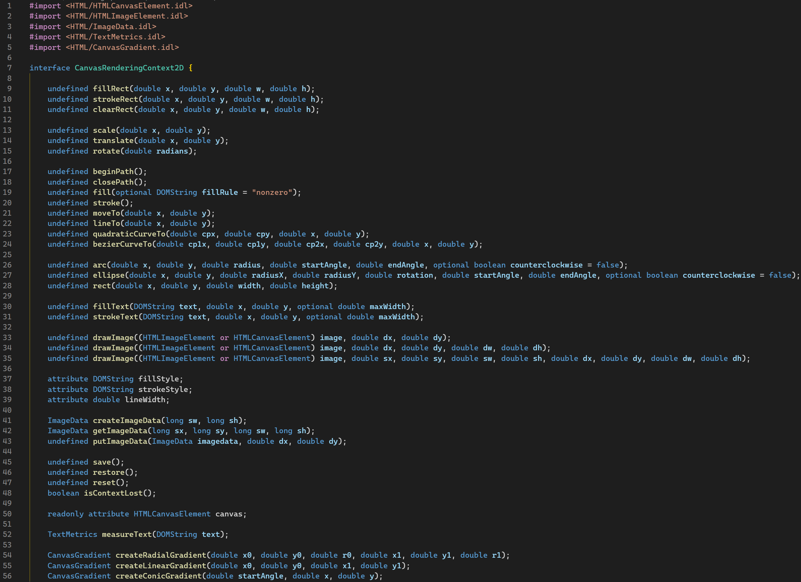

# serenity-dsl-syntaxhighlight – Syntax highlighting for SerenityOS' DSLs

Syntax highlighting for SerenityOS' Domain Specific Languages:

- `.ipc`: Endpoint specification for the Inter Process Communication protocol.
- `.gml`: Graphical Markup Language for creating SerenityOS GUI application layouts.
- `.idl`: [Web-IDL](https://webidl.spec.whatwg.org/) which SerenityOS's LibWeb directly uses to generate web API bindings.

## Features

Provides TextMate Grammar-based syntax highlighting for the IPC and GML languages. Syntax highlighting is mostly compliant with SerenityOS' own syntax highlighters (in the case of GML) and code generators (in the case of IPC).

Additionally it provides TextMate Grammar-based syntax highlighting for [Web-IDL](https://webidl.spec.whatwg.org/) with all extensions to it that SerenityOS uses.

### GML syntax highlighting

### IPC syntax highlighting

### Web IDL syntax highlighting

### GML formatting

Allows formatting GML files with SerenityOS's own GML formatter. This is accomplished via the Lagom build of gml-format, so in order for the formatter to work, you need to build Lagom (see the options for the `Meta/serenity.sh` main script) and your workspace directory needs to be the Serenity root itself in order for the GML formatter to be found under Build/lagom/gml-format.

## Known Issues

### GML

GML uses the .gml extension, which is also used for the GameMaker language. You may have to set the language for each file manually.

The GML formatter needs to save the file in order to format it, so formatting and keeping a file unsaved is not currently possible.

### Web-IDL

- Extended attribute highlighting may not be spec-compliant.

## Contributing

I always appreciate help with developing this extension. Here's some things you can do:

- [File an issue](https://github.com/kleinesfilmroellchen/serenity-dsl-syntaxhighlight/issues/new) on GitHub if something doesn't work as expected or if you are missing a feature. This is especially important when Serenity changes features of the DSLs (which doesn't happen often but can in theory do so at any time).
- Help with the Shell syntax highlighting, which is currently stalling around [on the shell branch](https://github.com/kleinesfilmroellchen/serenity-dsl-syntaxhighlight/tree/shell).
- Improve Serenity's `gml-format` and this extension's integration, so that more advanced features like selection formatting, saveless formatting or setting the formatter path are possible.
- Check and improve the spec compliance of the Web IDL highlighter.
